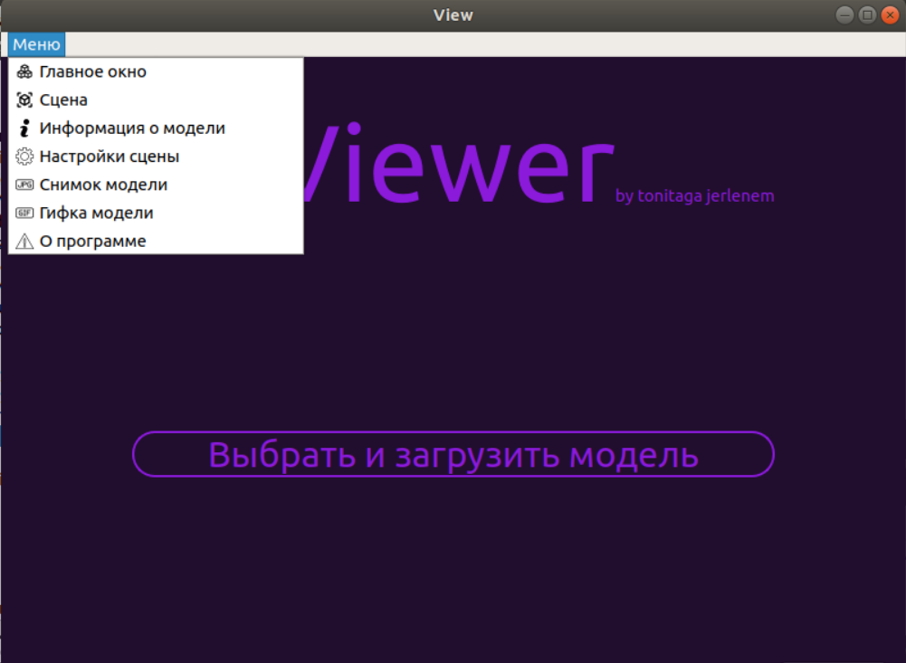
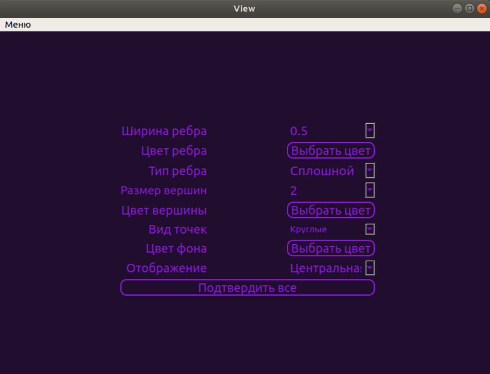
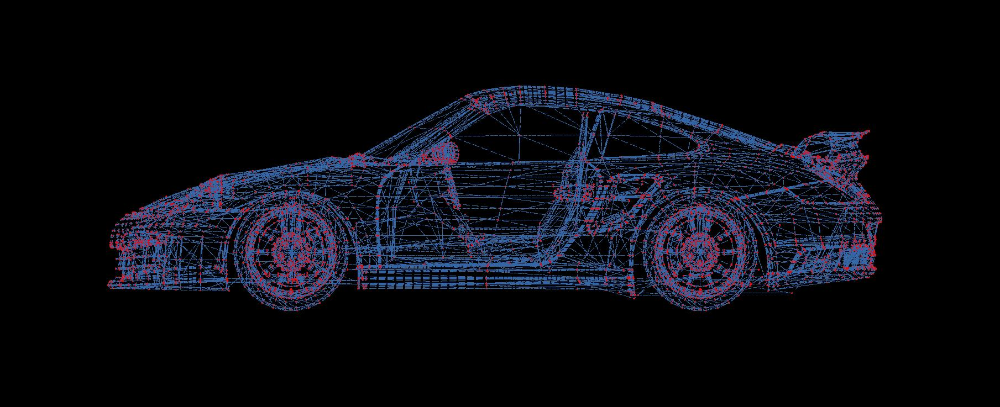

# 3DViewer v2.0

В данном проекте было реализовано приложение для просмотра 3D моделей в каркасном виде на языке программирования С++ в парадигме объектно-ориентированного программирования.

## 1. 3DViewer v2.0

Разработать программу для визуализации каркасной модели в трехмерном пространстве.

- Программа должна быть разработана на языке C++ стандарта C++17. 
- Код программы должен находиться в папке src 
- При написании кода необходимо придерживаться Google Style
- Сборка программы должна быть настроена с помощью Makefile со стандартным набором целей для GNU-программ: all, install, uninstall, clean, dvi, dist, tests. Установка должна вестись в любой другой произвольный каталог 
- Программа должна быть разработана в соответствии с принципами объектно-ориентированного программирования, структурный подход запрещен
- Должно быть обеспечено полное покрытие unit-тестами модулей, связанных с загрузкой моделей и аффинными преобразованиями
- В один момент времени должна быть только одна модель на экране.
- Программа должна предоставлять возможность:
    - Загружать каркасную модель из файла формата obj (поддержка только списка вершин и поверхностей).
    - Перемещать модель на заданное расстояние относительно осей X, Y, Z.
    - Поворачивать модель на заданный угол относительно своих осей X, Y, Z.
    - Масштабировать модель на заданное значение.
- В программе должен быть реализован графический пользовательский интерфейс, на базе любой GUI-библиотеки с API для C++ (Qt, SFML, GTK+, Nanogui, Nngui, etc.)
- Графический пользовательский интерфейс должен содержать:
    - Кнопку для выбора файла с моделью и поле для вывода его названия.
    - Зону визуализации каркасной модели.
    - Перемещения модели. 
    - Поворота модели. 
    - Масштабирования модели.  
    - Информацию о загруженной модели - название файла, кол-во вершин и ребер.
- Программа должна корректно обрабатывать и позволять пользователю просматривать модели с деталями до 100, 1000, 10 000, 100 000, 1 000 000 вершин без зависания (зависание - это бездействие интерфейса более 0,5 секунды).
- Программа должна быть реализована с использованием паттерна MVC, то есть:
    - не должно быть кода бизнес-логики в коде представлений
    - не должно быть кода интерфейса в контроллере и в модели
    - контроллеры должны быть тонкими
- Необходимо использовать минимум три различных паттерна проектирования (например, фасад, стратегия и команда)
- Классы должны быть реализованы внутри пространства имен `s21`
- Для осуществления афинных преобразований могут использоваться матрицы из библиотеки из предыдущего проекта s21_matrix+

## 2. Дополнительно. Настройки

- Программа должна позволять настраивать тип проекции (параллельная и центральная)
- Программа должна позволять настраивать тип (сплошная, пунктирная), цвет и толщину ребер, способ отображения (отсутствует, круг, квадрат), цвет и размер вершин
- Программа должна позволять выбирать цвет фона
- Настройки должны сохраняться между перезапусками программы

## 3. Дополнительно. Запись

  
- Программа должна позволять сохранять полученные ("отрендеренные") изображения в файл в форматах bmp и jpeg
- Программа должна позволять по специальной кнопке записывать небольшие "скринкасты" - текущие пользовательские аффинные преобразования загруженного объекта в gif-анимацию (640x480, 10fps, 5s)

